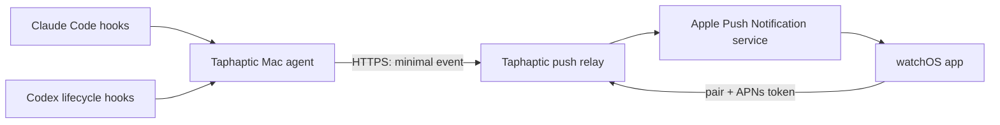

# Taphaptic: Codex Integration and App Store Publication Plan

Last reviewed: 2026-07-26
Repository snapshot: `68a6533c4e86`

## Goal

Publish Taphaptic as a watch-only Apple Watch app that sends a real watchOS
notification when Claude Code, the Codex desktop app, or both:

- complete a main task;
- complete a subagent task; or
- need the user's permission or input.

The App Store build must notify while Taphaptic is not open. Foreground-only
polling and haptics are not sufficient.

## Executive recommendation

Keep the Mac-side hook/agent, but add a minimal hosted push relay:



This is the smallest architecture that provides reliable background Apple
Watch notifications. watchOS sharply limits background execution, and the
current one-second polling loop stops whenever the app is inactive. Apple
supports direct APNs notifications for watch-only apps.

Keep the existing Bonjour/local API mode as a development or self-hosted
fallback. Do not make it the App Store notification path.

If the project must remain completely local with no hosted component, narrow
the product claim to "haptics while Taphaptic is open." That cannot satisfy the
goal of normal Apple Watch notifications while the app is closed.

## Current project review

### What is already solid

- A focused watch-only SwiftUI target exists and declares `WKWatchOnly`.
- The Go API has installation, pairing, channel isolation, event ingestion, and
  cursor-based reads.
- Pairing codes are short-lived, hashed at rest, single-use, and rate-limited.
- Claude Code `Stop`, `SubagentStop`, and optional attention hooks are installed
  without replacing unrelated Claude settings.
- The source field already exists in the event model, which is a good starting
  point for provider-neutral events.
- Shared Swift behavior has regression tests, and the backend has unit and
  smoke-test code.

### Release blockers and important gaps

| Priority | Finding | Evidence | Required outcome |
| --- | --- | --- | --- |
| P0 | The watch polls only while its scene is active. | `ContentView.swift:57-66`, `TaphapticModel.swift:201-212`, `TaphapticModel.swift:435-455` | Replace background delivery with direct APNs. Keep polling only for foreground synchronization or diagnostics. |
| P0 | There is no real APNs registration or notification handler. The "push token" is a hash of the local watch ID. | `TaphapticModel.swift:329-359`, `TaphapticModel.swift:937-944`; no entitlements file | Request notification permission, register with APNs, persist the real token, add the push entitlement, and handle foreground/notification-tap behavior. |
| P0 | The API and authentication names assume Claude is the only producer. | `/v1/claude/installations`, `ClaudeSessionToken`, `authScopeClaude` | Introduce provider-neutral installation and producer-token names while retaining compatibility for the existing Claude route. |
| P0 | Codex is not installed as an event source. | Only `~/.claude/settings.json` is patched. | Add a coexistence-safe Codex lifecycle hook installer and an adapter that consumes Codex hook JSON from stdin. |
| P0 | The Xcode target is not configured as a production App Store product. | `PRODUCT_BUNDLE_IDENTIFIER = local.taphaptic.watch`, no `DEVELOPMENT_TEAM`, `SKIP_INSTALL = YES`, version `0.1.0` | Create a production App ID, configure signing/versioning, make a valid archive, and validate it in App Store Connect. |
| P1 | UI copy and fallback event text still name Claude in provider-neutral states. | `TaphapticModel.swift:43-49`, `TaphapticModel.swift:642-652`, `TaphapticSharedModels.swift:30-53` | Display "Agent" by default and use the event source for "Claude Code" or "Codex." |
| P1 | Session and installation tokens are stored in `UserDefaults`. | `TaphapticModel.swift:768-801` | Move credentials to Keychain; retain only non-sensitive preferences/cursors in `UserDefaults`. |
| P1 | The LAN service uses cleartext HTTP. | `TaphapticServiceDiscovery.swift:98-108`, local ATS exception in the project | Use HTTPS for all hosted traffic. Limit cleartext to an explicitly labeled local/self-hosted mode. |
| P1 | There is no reviewer-friendly demo path. | Current setup requires cloning, starting the Go API, installing hooks, and owning a physical Mac/watch pair. | Add "Send test notification" after pairing and provide App Review with a live review installation or demo code. |
| P1 | Release automation and UI coverage are absent. | No CI, watch UI test target, App Store configuration, privacy manifest, or entitlements file | Add archive validation, TestFlight gates, physical-device notification tests, and release documentation. |

### Initial baseline verification on 2026-07-26

- `./scripts/test-shared-swift.sh`: passed, 12 tests.
- `go test ./... -count=1`: initially could not run because Go was not installed.
- `./scripts/build-watch-app.sh`: initially could not run because the watchOS
  26.5 platform/runtime component was missing, even though Xcode reported the
  SDK.
- Installed Xcode is 26.5, which meets Apple's current Xcode 26 upload minimum.
- The build helper checks for an SDK, not for an installed watchOS
  runtime/platform, so its auto-download guard did not catch this state.

### Implementation status on 2026-07-26

- Provider-neutral Claude Code and Codex hook installation, removal, mapping,
  payload minimization, and deduplication are implemented and tested.
- The relay now persists APNs device registrations, signs APNs JWTs, sends
  source-aware alerts, removes invalid device tokens, rate-limits public and
  authenticated operations, and supports full installation deletion.
- The watch app uses a real APNs registration token, keeps its watch session in
  Keychain, handles notification permission/foreground/tap callbacks, and
  exposes notification status and a test-notification action.
- App Store packaging is configured for bundle ID
  `com.dzzzgnr.taphaptic.watch`, team `X53HKYK69N`, version 1.0.0 (1), Push
  Notifications, the privacy manifest, production relay injection, and
  watch-only installation.
- Go unit, race, and vet checks pass. Shared Swift tests pass 12/12. A signed
  watchOS simulator build and an unsigned Release generic-device build pass.
- The watchOS 26.5 simulator pairing flow, notification permission, Keychain
  persistence across relaunch, and local event delivery have been exercised on
  a Series 11 46 mm simulator; four 416 x 496 screenshots are ready.
- `render.yaml` defines a Frankfurt production relay with HTTPS, health checks,
  an encrypted persistent disk and daily snapshots. Its final sync awaits the
  hosting login and a production APNs provider key.
- A signed device archive and App Store Connect upload await Apple account
  reauthentication plus creation of the push-enabled App ID/profile.

## Product contract

### Provider-neutral event schema

Preserve the four user-facing event kinds but stop encoding provider names into
them:

```json
{
  "schemaVersion": 1,
  "kind": "completed",
  "source": "codex",
  "sourceEvent": "Stop",
  "occurredAt": "2026-07-26T10:00:00Z",
  "dedupeKey": "codex:<session_id>:<turn_id>:Stop",
  "title": "Codex completed",
  "body": "Agent completed a task"
}
```

Allowed values:

- `kind`: `completed`, `subagent_completed`, `failed`, `attention`;
- `source`: `claude-code`, `codex`, and later other adapters;
- `sourceEvent`: the original provider event for diagnostics.

Do not transmit prompts, transcript contents, repository files, tool arguments,
or the final answer by default. For the first App Store version, the relay only
needs source, event kind, time, a deduplication key, and short generic display
text.

### Event mapping

| Taphaptic kind | Claude Code | Codex |
| --- | --- | --- |
| `completed` | `Stop` | `Stop` |
| `subagent_completed` | `SubagentStop` | `SubagentStop` |
| `attention` | `Notification(permission_prompt)` and `Notification(idle_prompt)` | `PermissionRequest`; add a later mapping only when Codex exposes another documented attention event |
| `failed` | Explicit/manual failure event today | Do not infer from `Stop`; add only if a documented payload reliably distinguishes failure |

Deduplicate by provider, session, turn/subagent, and event name. Hooks can be
configured at multiple levels, and a user may run Claude and Codex concurrently.

### Notification behavior

- A background event produces a standard Apple Watch notification through APNs.
- The notification title names the source: "Claude Code completed" or "Codex
  needs permission."
- The user can enable Claude, Codex, or both, and can independently disable
  completion, subagent, and attention notifications.
- watchOS controls the background notification haptic. Custom
  `WKInterfaceDevice` haptics and speech remain foreground-only enhancements.
- Opening a notification shows the latest event and source in Taphaptic.
- Replayed events never create a second alert.

## Implementation phases

### Phase 0 — Validate the two irreversible assumptions

1. Install a temporary, non-destructive Codex user hook and verify in the
   current Codex desktop app that `Stop`, `SubagentStop`, and
   `PermissionRequest` execute with the documented JSON payload.
2. Run a direct APNs proof of concept on a physical Apple Watch while Taphaptic
   is closed and the display is asleep.
3. Decide the relay host, production domain, operating owner, data region,
   retention period, and uptime/error-monitoring baseline.

Exit gate:

- Codex desktop fires the required lifecycle hooks, or the plan records a
  supported fallback and its limitation.
- A direct APNs notification reaches the physical watch in background.
- The hosted relay and privacy model have an owner.

### Phase 1 — Make the Mac producer layer provider-neutral

1. Rename internal concepts:
   - `ClaudeSessionToken` -> `ProducerToken`;
   - `authScopeClaude` -> `authScopeProducer`;
   - `/v1/claude/installations` -> `/v1/installations`.
2. Keep the old route and response key as a deprecated compatibility alias for
   one release.
3. Extend `taphapticctl`:
   - `connect --provider claude`;
   - `connect --provider codex`;
   - `connect --provider all`;
   - `disconnect --provider ...`;
   - `emit --source ... --action ...`.
4. Split provider-specific configuration into adapters rather than adding
   Codex branches to Claude settings code.
5. Make the installed hook read its JSON payload from stdin, normalize it, and
   emit the provider-neutral event schema.
6. Add tests for:
   - preserving unrelated Claude and Codex settings/hooks;
   - idempotent install/uninstall;
   - paths containing spaces;
   - user and project scopes;
   - hook JSON parsing and event mapping;
   - deduplication.

#### Codex integration choice

Use Codex lifecycle hooks, not `notify`, as the primary integration:

- patch `~/.codex/hooks.json` for user-wide support or
  `<repo>/.codex/hooks.json` for project scope;
- add `Stop`, `SubagentStop`, and `PermissionRequest` command hooks;
- preserve every existing hook definition;
- tell the user to review and trust the hook through Codex's hook UI;
- never use `--dangerously-bypass-hook-trust`;
- never replace an existing user `notify` command.

Codex documents hooks as a stable feature and lets multiple matching hooks run.
It documents external `notify` programs under CLI notifications, so `notify`
is not the primary route for Codex desktop support.

Exit gate:

- Claude-only, Codex-only, and combined setup all pass end-to-end producer
  tests.
- Existing user configuration is byte-for-byte unchanged outside the inserted
  Taphaptic entries.
- Uninstall removes only Taphaptic entries.

### Phase 2 — Add the minimal HTTPS push relay and APNs

1. Create a production HTTPS service for:
   - installation creation/rotation;
   - short pairing-code creation and claim;
   - APNs device-token registration/update/removal;
   - authenticated event ingestion;
   - "send test notification";
   - unpair/delete.
2. Store the APNs provider signing key only in the server's secret manager.
   Never ship it in the watch app, Mac binary, repository, or CI logs.
3. Associate APNs tokens with environment, bundle ID/topic, installation, and
   last-seen time. Remove invalid/unregistered tokens based on APNs responses.
4. Send alert pushes directly to the watch-only app with the correct APNs
   topic, push type, priority, collapse/deduplication behavior, and generic
   payload.
5. Add expiry and cleanup jobs:
   - pairing codes: about 10 minutes;
   - event payloads: no storage or a short operational window;
   - inactive installations/device tokens: documented retention and deletion.
6. Put rate limits on installation, pairing, test pushes, and event ingestion.
   Trust forwarded client IP headers only from the deployed reverse proxy.
7. Add structured metrics without event bodies or tokens:
   accepted events, deduplicated events, APNs success/failure reason, invalid
   token cleanup, and delivery latency.

Exit gate:

- APNs sandbox and production paths both work.
- Notification arrives with the app closed and with the watch away from the
  foreground UI.
- Duplicate hook delivery creates one watch notification.
- Deleting/unpairing an installation prevents all later pushes.

### Phase 3 — Make the watch app a production notification client

1. Add a watch application delegate/notification coordinator:
   - request alert and sound permission at a contextual onboarding step;
   - call `registerForRemoteNotifications`;
   - send the real APNs token to the relay;
   - update it whenever Apple rotates it;
   - implement foreground presentation and notification-tap routing.
2. Add the Push Notifications capability and correct `aps-environment`
   entitlement for development and distribution.
3. Replace the synthetic `fallbackPushToken()`.
4. Store producer/watch credentials in Keychain.
5. Change pairing to the HTTPS relay. Keep Bonjour discovery under a clearly
   separated local/self-hosted mode if it remains.
6. Remove continuous one-second polling as the notification mechanism. Fetch
   once on activation or notification tap if server state is required.
7. Make UI copy source-aware and provider-neutral:
   - default to "Agent";
   - show "Claude Code" or "Codex" from the event source;
   - remove Claude-specific failure, attention, and subagent speech/text.
8. Add onboarding:
   - what runs on the Mac;
   - choose Claude, Codex, or both;
   - enter pairing code;
   - grant notifications;
   - send a test notification;
   - show troubleshooting and privacy links.
9. Add controls for event kinds, sound, source filters, unpair/delete, and
   notification permission state.
10. Verify VoiceOver labels, reduced motion, large text/truncation, color
    contrast, all supported watch sizes, and offline/retry states.

Exit gate:

- A new user can pair and receive a test push without Xcode.
- Notification denial and later Settings changes are explained and recoverable.
- No provider name appears incorrectly in the other provider's event.

### Phase 4 — Repair and validate App Store packaging

1. Enroll/confirm the Apple Developer Program team and accept current
   agreements.
2. Create the production App ID and APNs key/certificate.
3. Replace `local.taphaptic.watch` with the owned reverse-DNS bundle ID.
4. Set the development team and automatic/manual release signing policy.
5. Set version `1.0.0` and automate monotonically increasing build numbers.
6. Change `SKIP_INSTALL` as required for a valid archive. If the hand-written
   project still cannot produce an App Store watch-only archive, recreate the
   shell from Xcode 26's Watch-only App template and move the existing source,
   resources, and tests into it.
7. Keep or deliberately lower the current watchOS 11 minimum after device
   coverage testing. Document the supported watch models.
8. Validate the Icon Composer asset in an archive and on all required product
   surfaces.
9. Install the watchOS 26 platform/runtime, then run:
   - simulator build;
   - Release generic-device build;
   - signed Archive;
   - Organizer validation;
   - TestFlight upload.
10. Fix `build-watch-app.sh` so it verifies the installed runtime/platform, not
    just the presence of `watchsimulator` in `xcodebuild -showsdks`.

Apple currently requires App Store uploads to use Xcode 26 or later with the
watchOS 26 SDK or later. Recheck this immediately before every release.

Exit gate:

- A signed archive validates without warnings that affect submission.
- App Store Connect recognizes the binary as watch-only.
- Installation from TestFlight works on a clean physical watch.

### Phase 5 — Privacy, security, and operational readiness

1. Write and host:
   - privacy policy;
   - support page;
   - setup/uninstall documentation;
   - service status/contact path.
2. Complete a data inventory for installation IDs, APNs tokens, IP/log data,
   event metadata, and retention. Use it to answer App Privacy accurately.
3. Add in-app unpair/delete and a documented server-side deletion path.
4. Confirm export-compliance answers for HTTPS/APNs. Set
   `ITSAppUsesNonExemptEncryption` only after confirming the correct answer.
5. Threat-model:
   - stolen producer/watch tokens;
   - four-digit pairing brute force;
   - replay and duplicate events;
   - APNs token leakage;
   - log leakage;
   - relay abuse and notification spam;
   - compromised hook scripts or installer downloads.
6. Sign and notarize the distributed Mac binary/helper. Publish checksums and a
   versioned installer. Prefer a Homebrew formula or signed macOS helper over a
   raw build-from-clone onboarding path.
7. Pin production dependencies, scan secrets, and define key rotation,
   backup/restore, incident response, and relay availability monitoring.

Exit gate:

- Privacy label matches observed network behavior.
- No secret or full bearer token appears in logs.
- A compromised/revoked installation can be disabled promptly.
- The review/demo service is stable and monitored.

### Phase 6 — TestFlight and App Store submission

1. Create the App Store Connect app record by selecting the iOS platform and
   adding Apple Watch information. A watch-only app does not need iPhone
   screenshots.
2. Prepare:
   - name (30 characters maximum);
   - subtitle (30 characters maximum);
   - description that explains both Claude Code and Codex integrations;
   - keywords, category, support URL, privacy-policy URL, copyright;
   - updated age-rating questionnaire;
   - export-compliance response;
   - one to ten Apple Watch screenshots.
3. Use one accepted screenshot size consistently across localizations. A good
   initial choice is 416 x 496 for current Series 10/11 layouts; verify Apple's
   current specification before export.
4. Avoid implying endorsement by Anthropic or OpenAI. Describe integrations
   factually and include an independence disclaimer where appropriate.
5. Internal TestFlight:
   - clean install;
   - first launch and notification permission;
   - Claude-only, Codex-only, and both;
   - background, locked display, Wi-Fi, cellular/proxied, offline recovery;
   - token rotation, re-pairing, deduplication, and unpair/delete.
6. External TestFlight with at least several different watch sizes and network
   conditions. Collect crashes, notification latency, and setup failures.
7. Give App Review:
   - a working review pairing code/install;
   - exact setup steps;
   - a "Send test notification" path that requires no local build;
   - explanation that events originate from a user-owned Mac;
   - explanation of stored data and deletion;
   - contact details and any non-obvious hardware requirements.
8. Keep the relay and review account active throughout review.
9. Submit, monitor App Store Connect messages, and use manual release after
   approval for version 1.0.

Exit gate:

- All required metadata and privacy answers are complete.
- Review can exercise the core notification flow without contacting the team.
- Version 1.0 is approved and the production relay is monitored.

## Test matrix

The following is the minimum release matrix:

| Area | Cases |
| --- | --- |
| Sources | Claude only, Codex only, both enabled, neither enabled |
| Events | main completion, subagent completion, permission request, duplicate, stale, malformed |
| Watch state | app open, app backgrounded, display asleep, app terminated, notification denied, notification later enabled |
| Network | same LAN, different Wi-Fi, watch through iPhone proxy, cellular watch, Mac briefly offline, relay briefly unavailable |
| Lifecycle | new install, upgrade from local prototype, re-pair, token rotation, unpair/delete, reinstall |
| Devices | smallest supported watch, current 42/46 mm class, Ultra class, minimum and current watchOS |
| Security | invalid/expired/reused code, rate limiting, revoked producer token, forged event source, replay |

Automated gates:

- `go test ./... -count=1`;
- Go race tests for stores/API;
- Swift unit tests;
- adapter fixture tests using real Claude and Codex hook payloads;
- API integration tests with a fake APNs client;
- signed archive validation;
- a physical-watch APNs smoke test before every release candidate.

## Suggested implementation order and rough effort

For one experienced engineer, plan roughly:

1. Codex hook and event-contract spike: 1-2 days.
2. Provider-neutral CLI/API and tests: 3-5 days.
3. Push relay, APNs, security, and observability: 5-10 days.
4. watchOS notification client and onboarding: 4-7 days.
5. packaging, TestFlight hardening, metadata, and review materials: 4-7 days.

Expected engineering range: about 3-6 weeks, plus external TestFlight feedback
and App Review time. The APNs/relay decision and App Store archive validation
are on the critical path.

## Go/no-go checklist

Do not submit version 1.0 until all are true:

- [ ] Codex desktop hook behavior is verified on the currently shipped app.
- [ ] Claude and Codex can be enabled independently and together.
- [ ] A closed watch app receives a direct APNs alert on a physical watch.
- [ ] No duplicate event produces a duplicate notification.
- [ ] Production HTTPS, secrets, deletion, retention, and monitoring are live.
- [ ] Tokens are in Keychain on watch and protected at rest on the server/Mac.
- [ ] Signed Xcode 26+ archive validates in App Store Connect.
- [ ] Swift, Go, API integration, simulator, and physical-watch checks pass.
- [ ] Privacy policy, App Privacy, age rating, export compliance, screenshots,
      support URL, and review notes are complete.
- [ ] App Review has a stable demo/review flow.

## Current authoritative references

- [Codex lifecycle hooks](https://learn.chatgpt.com/docs/hooks)
- [Codex notification surfaces](https://learn.chatgpt.com/docs/notifications)
- [Codex advanced notification configuration](https://learn.chatgpt.com/docs/config-file/config-advanced#notifications)
- [Apple: Creating independent watchOS apps](https://developer.apple.com/documentation/watchos-apps/creating-independent-watchos-apps)
- [Apple: Enabling and receiving watchOS notifications](https://developer.apple.com/documentation/watchos-apps/enabling-and-receiving-notifications)
- [Apple: Keeping watchOS content up to date](https://developer.apple.com/documentation/watchos-apps/keeping-your-watchos-app-s-content-up-to-date)
- [Apple: Current submission requirements](https://developer.apple.com/news/upcoming-requirements/)
- [Apple: Add watchOS app information](https://developer.apple.com/help/app-store-connect/create-an-app-record/add-watchos-app-information)
- [Apple: Apple Watch screenshot specifications](https://developer.apple.com/help/app-store-connect/reference/app-information/screenshot-specifications/)
- [Apple: Manage app privacy](https://developer.apple.com/help/app-store-connect/manage-app-information/manage-app-privacy/)
- [Apple: Export compliance](https://developer.apple.com/help/app-store-connect/manage-app-information/overview-of-export-compliance)
- [Apple: App Review Guidelines](https://developer.apple.com/app-store/review/guidelines/)
